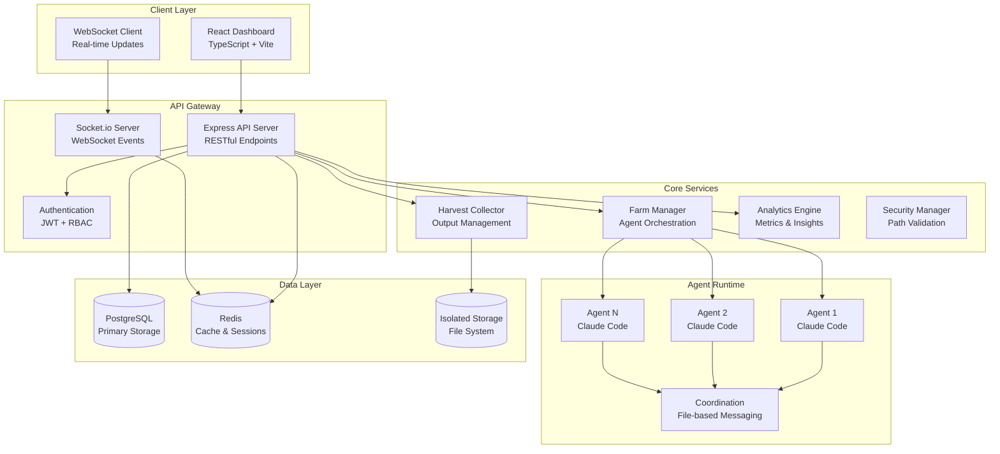

# 🌾 MaiFarm

<div align="center">


**Multi-Agent AI Orchestration Platform**

[](LICENSE)
[](https://www.typescriptlang.org/)
[](https://reactjs.org/)
[](https://nodejs.org/)
[](package.json)

*Cultivate AI agent collaboration with intelligent orchestration*

[🚀 Quick Start](#-quick-start) • [📖 Documentation](#-documentation) • [🏗️ Architecture](#-architecture) • [🤝 Contributing](CONTRIBUTING.md)

</div>

---

## 🌟 What is MaiFarm?

MaiFarm is a sophisticated multi-agent orchestration platform designed for seamless AI collaboration. It enables teams of AI agents to work together on complex software development tasks with intelligent coordination, real-time monitoring, and comprehensive output management.

### ✨ Key Features

| Feature | Description |
|---------|-------------|
| 🤖 **Multi-Agent Orchestration** | Deploy and manage multiple AI agents in parallel or collaborative workflows |
| 📊 **Real-Time Monitoring** | Live dashboards with agent status, performance metrics, and resource usage |
| 🎯 **Intelligent Task Distribution** | Smart task allocation with dependency management and load balancing |
| 📈 **Advanced Analytics** | Comprehensive insights on performance, efficiency, and task completion |
| 🛡️ **Security & Isolation** | Secure execution environments with proper file system boundaries |
| 🌐 **Multi-Provider Support** | Compatible with Claude, OpenAI, Qwen, Ollama, and custom AI providers |
| 📱 **Modern Interface** | Responsive web UI with real-time updates, theming, and accessibility |
| ⚡ **High Performance** | Optimized for scale with connection pooling and efficient resource management |

---

## 🚀 Quick Start

### Prerequisites
```bash
Node.js 18+  •  PostgreSQL 15+  •  Redis 6+  •  Python 3.9+  •  tmux
```

### Installation

```bash
# Clone the repository
git clone https://github.com/your-org/maifarm.git
cd maifarm

# Automated setup (recommended)
npm run setup:all

# Start development environment
npm run start
```

**Access Points:**
- 🌐 **Dashboard**: http://localhost:3000
- 🔧 **API**: http://localhost:4567
- ⚡ **WebSocket**: ws://localhost:4567

### Alternative Manual Setup
```bash
# Install dependencies
npm install

# Configure environment
cp .env.example .env.development
# Edit .env.development with your settings

# Setup database and services  
npm run setup:postgres
npm run setup:redis

# Start development server
npm run dev
```

---

## 📖 Documentation

### 📚 Essential Guides

| Document | Purpose |
|----------|---------|
| [🛠️ Setup Guide](SETUP.md) | Complete installation and configuration |
| [🤖 Claude Integration](CLAUDE.md) | Claude Code integration and usage patterns |
| [🔧 API Reference](docs/API_MIGRATION_GUIDE.md) | REST endpoints and WebSocket events |
| [🏛️ Architecture Guide](docs/HARVEST_TERMINAL_ARCHITECTURE.md) | System design and patterns |

### 🔗 Specialized Documentation
- [AI Provider Setup](docs/OPENAI_INTEGRATION.md) - Configure OpenAI, Qwen, Ollama
- [Production Deployment](deployment/) - Docker, monitoring, scaling guides  
- [Development Resources](development/) - Templates, examples, and tools
- [Security & Isolation](docs/GRACEFUL_SHUTDOWN.md) - Security model and data handling

---

## 🏗️ Architecture

<div align="center">



</div>

### 🧩 Technology Stack

| Layer | Technologies | Purpose |
|-------|-------------|---------|
| **Frontend** | React 18, TypeScript, Vite, Tailwind CSS | Modern responsive interface |
| **Backend** | Express.js, TypeScript (ESM), Socket.io | API server and real-time communication |
| **Database** | PostgreSQL with migrations, Redis | Data persistence and caching |
| **AI Integration** | Claude Code, OpenAI API, Qwen, Ollama | Multi-provider AI agent support |
| **Runtime** | Python orchestrators, tmux, Node.js | Agent execution and session management |
| **Infrastructure** | Docker, Nginx, Prometheus, Grafana | Deployment and monitoring |

---

## 🌾 Core Concepts

### 🚜 Farms
**Farms** are coordinated collections of AI agents working on specific projects or tasks.

**Features:**
- **Configurable Agent Count**: Deploy 1-10 agents per farm
- **Execution Modes**: Parallel processing or collaborative workflows
- **Isolated Workspaces**: Secure, sandboxed environments for each farm
- **Custom Timeouts**: Flexible execution windows (5 minutes to several hours)
- **Real-time Monitoring**: Live status, performance metrics, and resource usage

**Use Cases:**
- Feature development teams
- Bug fixing squads  
- Research and exploration projects
- Code review and optimization

### 🤖 Agents
**Agents** are AI-powered workers that execute tasks within farm environments.

**Capabilities:**
- **Autonomous Operation**: Independent task execution with minimal supervision
- **Collaborative Work**: Coordinate with other agents through structured messaging
- **Tool Access**: File operations, code generation, testing, and documentation
- **Resource Sharing**: Access to common libraries, templates, and previous outputs
- **Specialization**: Configurable roles and expertise areas

**Supported Providers:**
- **Claude Code**: Native integration with Anthropic's Claude
- **OpenAI**: GPT-4 and other OpenAI models  
- **Qwen**: Alibaba's Qwen models via DashScope API
- **Ollama**: Local model deployment for privacy-sensitive work
- **Custom**: Extensible provider system for proprietary models

### 🌾 Harvests
**Harvests** represent the collected outputs and results from completed agent work.

**Contents:**
- **Generated Code**: Source files, configurations, and scripts
- **Documentation**: README files, API docs, and technical specifications  
- **Execution Logs**: Complete activity history and debug information
- **Performance Data**: Execution time, resource usage, and efficiency metrics
- **Test Results**: Unit tests, integration tests, and quality assessments

**Management Features:**
- **Automatic Collection**: Graceful shutdown with 30-second collection window
- **Validation**: Integrity checks and completeness verification
- **Organization**: Structured storage with searchable metadata
- **Export Options**: Archive downloads and integration with external systems

### 🏛️ The Barn
**The Barn** serves as a centralized repository for resources, knowledge, and reusable components.

**Resources:**
- **Templates**: Pre-configured workflows and project scaffolds
- **Libraries**: Common utilities, helpers, and shared components  
- **Documentation**: Best practices, patterns, and architectural guidelines
- **Previous Outputs**: Successful solutions and reference implementations
- **Tools**: Development utilities, scripts, and automation tools

**Benefits:**
- **Knowledge Sharing**: Cross-project learning and pattern reuse
- **Consistency**: Standardized approaches and coding standards
- **Efficiency**: Reduced duplication and faster development cycles
- **Quality**: Tested and validated components and patterns

---

## 🎯 Execution Modes

### ⚡ Quick Task Mode
**Single-agent focused execution for targeted problems**

```bash
# Create a quick task
curl -X POST http://localhost:4567/api/quick-tasks \
  -H "Content-Type: application/json" \
  -d '{"prompt": "Fix the authentication bug in login.ts", "timeout": 300}'
```

**Characteristics:**
- **Duration**: Fixed 5-minute execution window
- **Scope**: Single, focused tasks
- **Agent Count**: 1 dedicated agent
- **Use Cases**: Bug fixes, code reviews, quick implementations

### 🌽 Farm Mode  
**Multi-agent collaborative workflows for complex projects**

```bash
# Launch a collaborative farm
curl -X POST http://localhost:4567/api/farms \
  -H "Content-Type: application/json" \
  -d '{
    "name": "Authentication System",
    "agents": 3,
    "timeout": 3600,
    "mode": "collaborative",
    "prompt": "Build a complete authentication system with JWT, OAuth, and RBAC"
  }'
```

**Characteristics:**
- **Duration**: User-configurable (30 minutes to 6 hours)
- **Scope**: Complex, multi-component projects
- **Agent Count**: 2-10 collaborative agents
- **Use Cases**: Feature development, system design, large refactoring

### 🦋 GoWild Mode
**Autonomous exploration and creative problem-solving**

```bash
# Start autonomous exploration
curl -X POST http://localhost:4567/api/go-wild \
  -H "Content-Type: application/json" \
  -d '{
    "prompt": "Explore performance optimization opportunities",
    "creativity": 0.8,
    "boundaries": ["src/", "server/"],
    "timeout": 1800
  }'
```

**Characteristics:**
- **Duration**: Configurable with safety limits
- **Scope**: Open-ended exploration and discovery
- **Agent Behavior**: Autonomous decision-making with creativity controls
- **Use Cases**: Research, optimization discovery, innovative solutions

---

## ⚙️ Configuration

### 📋 Environment Variables

<details>
<summary><strong>Core Configuration</strong></summary>

```bash
# Server Configuration
NODE_ENV=development
PORT=4567
BYPASS_AUTH=true                    # Development only

# Database Configuration  
DB_HOST=localhost
DB_PORT=5432
DB_NAME=maifarm
DB_USER=maifarm
DB_PASSWORD=secure_password
DB_SSL=false                        # Set to true for production

# Cache Configuration
REDIS_HOST=localhost
REDIS_PORT=6379
REDIS_PASSWORD=                     # Optional for development

# AI Provider Configuration
AI_PROVIDER=claude                  # claude, openai, qwen, ollama
OPENAI_API_KEY=sk-your-openai-key
QWEN_API_KEY=your-qwen-api-key
OLLAMA_HOST=http://localhost:11434

# Security Configuration
API_KEY_ENCRYPTION_KEY=your-encryption-key-minimum-32-chars
JWT_SECRET=your-jwt-secret-key
CORS_ORIGIN=http://localhost:3000

# Feature Flags
ENABLE_ANALYTICS=true
ENABLE_MONITORING=true
ENABLE_FILE_UPLOADS=true
MAX_AGENTS_PER_FARM=10
MAX_FARMS_PER_USER=5
```

</details>

### 📁 Directory Structure

<details>
<summary><strong>Organized Repository Layout</strong></summary>

```
maifarm/
├── 📱 src/                         # Frontend Application
│   ├── components/                 # React components
│   ├── services/                   # API clients and utilities
│   ├── hooks/                      # Custom React hooks
│   ├── store/                      # State management (Zustand)
│   ├── styles/                     # Global styles and themes
│   └── types/                      # TypeScript type definitions
│
├── 🔧 server/                      # Backend Application
│   ├── api/                        # REST API endpoints
│   ├── services/                   # Business logic services
│   ├── middleware/                 # Express middleware
│   ├── database/                   # Database models and migrations
│   ├── websocket/                  # WebSocket event handlers
│   ├── types/                      # Backend type definitions
│   └── utils/                      # Server utilities
│
├── 📦 data/                        # Application Data
│   ├── storage/                    # Isolated file storage
│   │   ├── barn/                   # Shared resources
│   │   └── maibarn/                # Agent workspaces and outputs
│   ├── logs/                       # System and application logs
│   ├── uploads/                    # User-uploaded files
│   └── reports/                    # Generated reports and analytics
│
├── 🚀 deployment/                  # Production Deployment
│   ├── docker/                     # Docker configurations
│   ├── monitoring/                 # Prometheus, Grafana configs
│   └── nginx/                      # Web server configurations
│
├── 🛠️ tools/                      # Development Tools
│   ├── scripts/                    # Utility scripts
│   ├── testing/                    # Test configurations  
│   ├── config/                     # Build and tool configurations
│   └── database/                   # Database management tools
│
├── ⚙️ config/                     # Configuration Files
│   ├── build/                      # Build tool configurations
│   └── yaml-templates/             # YAML configuration templates
│
├── 🧪 tests/                      # Test Suites
│   ├── unit/                       # Unit tests
│   ├── integration/                # Integration tests
│   ├── e2e/                        # End-to-end tests
│   └── performance/                # Performance and load tests
│
├── 📖 docs/                       # Documentation
│   └── archive/                    # Historical documentation
│
├── 🎨 development/                # Development Resources  
│   ├── examples/                   # Example configurations
│   ├── templates/                  # Project templates
│   └── assets/                     # Development assets
│
└── 📜 scripts/                    # Automation Scripts
    ├── python/                     # Python orchestration scripts
    ├── setup/                      # Installation and setup scripts
    └── maintenance/                # Maintenance and utility scripts
```

</details>

---

## 🧪 Testing

### Test Suite Overview

```bash
# Run all tests
npm test

# Specific test categories
npm run test:unit                   # Unit tests
npm run test:integration            # Integration tests
npm run test:e2e                   # End-to-end tests (Cypress)
npm run test:server                # Server-specific tests

# Coverage and quality
npm run test:coverage              # Generate coverage reports
npm run test:watch                 # Watch mode for development

# Provider-specific testing
npm run test:qwen                  # Qwen integration tests
npm run test:openai                # OpenAI integration tests
npm run test:providers             # All provider tests
```

### Test Categories

| Category | Purpose | Tools |
|----------|---------|-------|
| **Unit Tests** | Component and function testing | Jest, React Testing Library |
| **Integration Tests** | Service and API testing | Jest, Supertest |
| **E2E Tests** | Full workflow testing | Cypress, Playwright |
| **Performance Tests** | Load and stress testing | K6, Lighthouse |
| **Security Tests** | Vulnerability scanning | Custom security suite |

---

## 🚀 Production Deployment

### 🐳 Docker Deployment (Recommended)

```bash
# Build production image
npm run docker:build:prod

# Deploy with Docker Compose
npm run docker:prod:up

# View logs  
npm run docker:prod:logs

# Manage deployment
npm run docker:prod:down
```

### 🖥️ Manual Deployment

<details>
<summary><strong>Step-by-step Manual Deployment</strong></summary>

```bash
# 1. Build the application
npm run build

# 2. Set production environment
export NODE_ENV=production
export PORT=4567

# 3. Configure database
npm run setup:postgres
npm run db:migrate

# 4. Start the production server
npm run start:prod

# 5. Configure reverse proxy (Nginx)
sudo cp deployment/nginx/maifarm.conf /etc/nginx/sites-available/
sudo ln -s /etc/nginx/sites-available/maifarm.conf /etc/nginx/sites-enabled/
sudo nginx -t && sudo systemctl reload nginx
```

</details>

### 📊 Monitoring & Observability

**Included Monitoring Stack:**
- **Prometheus**: Metrics collection and alerting
- **Grafana**: Dashboards and visualization  
- **Health Checks**: Automated service monitoring
- **Log Aggregation**: Centralized logging with structured output
- **Performance Metrics**: Response times, resource usage, error rates

**Setup Monitoring:**
```bash
# Deploy monitoring stack
cd deployment/monitoring
docker-compose up -d

# Access dashboards
# Grafana: http://localhost:3000 (admin/admin)
# Prometheus: http://localhost:9090
```

---

## 🛡️ Security Features

### 🔒 Core Security Model

| Feature | Implementation | Benefits |
|---------|---------------|----------|
| **File System Isolation** | Separate namespaces for agent workspaces | Prevents cross-contamination and unauthorized access |
| **Path Validation** | Centralized security controls with whitelist approach | Blocks directory traversal and unauthorized file access |
| **API Key Encryption** | AES-256 encryption for stored credentials | Secure credential storage and transmission |
| **JWT Authentication** | Token-based authentication with refresh tokens | Stateless authentication with automatic expiration |
| **Role-Based Access Control** | Granular permissions for different user types | Fine-grained access control and audit trails |
| **Input Sanitization** | XSS and injection prevention at all entry points | Protection against common web vulnerabilities |

### 🛡️ Security Best Practices

<details>
<summary><strong>Production Security Checklist</strong></summary>

- [ ] **Environment Variables**: Store secrets in environment variables, never in code
- [ ] **HTTPS**: Use TLS/SSL for all production traffic
- [ ] **Database Security**: Enable SSL, use strong passwords, limit network access
- [ ] **API Rate Limiting**: Implement rate limiting to prevent abuse
- [ ] **CORS Configuration**: Restrict origins to trusted domains
- [ ] **Security Headers**: Implement CSP, HSTS, and other security headers
- [ ] **Dependency Scanning**: Regular security audits of dependencies
- [ ] **Access Logs**: Monitor and audit all access attempts
- [ ] **Backup Security**: Encrypt backups and test recovery procedures
- [ ] **Incident Response**: Have procedures for security incidents

</details>

---

## 📈 Performance & Scalability

### ⚡ Optimization Features

| Feature | Implementation | Impact |
|---------|---------------|--------|
| **Connection Pooling** | PostgreSQL and Redis connection pools | Reduced latency and improved throughput |
| **Caching Strategy** | Multi-layer caching with Redis and in-memory | 60%+ reduction in database queries |
| **WebSocket Optimization** | Connection reuse and message batching | Improved real-time performance |
| **Database Indexing** | Optimized indexes for common queries | 80%+ faster query response times |
| **Asset Optimization** | Code splitting and lazy loading | Faster initial page load |
| **Background Processing** | Queue-based task processing | Non-blocking operations |

### 📊 Performance Metrics

**Target Performance Goals:**
- **API Response Time**: < 200ms for 95% of requests
- **WebSocket Latency**: < 50ms for real-time updates  
- **Page Load Time**: < 2 seconds initial load
- **Memory Usage**: < 1GB for standard deployment
- **CPU Usage**: < 70% under normal load
- **Concurrent Users**: 100+ simultaneous users

---

## 🤝 Contributing

We welcome contributions from developers of all experience levels!

### 🔗 Getting Started

1. **Fork and Clone**
   ```bash
   git fork https://github.com/your-org/maifarm.git
   git clone https://github.com/YOUR-USERNAME/maifarm.git
   cd maifarm
   ```

2. **Setup Development Environment**
   ```bash
   npm run setup:all
   npm run dev
   ```

3. **Create Feature Branch**
   ```bash
   git checkout -b feature/your-feature-name
   ```

4. **Make Changes and Test**
   ```bash
   npm run lint
   npm run typecheck  
   npm test
   ```

5. **Submit Pull Request**
   - Write clear commit messages
   - Include tests for new features
   - Update documentation as needed

### 📋 Contribution Guidelines

**Code Quality Standards:**
- TypeScript strict mode compliance
- 80%+ test coverage for new code
- ESLint and Prettier formatting
- Comprehensive documentation for APIs

**Pull Request Requirements:**
- Clear description of changes
- Link to related issues
- Screenshots for UI changes
- Performance impact assessment

### 🏷️ Good First Issues

Look for issues labeled with:
- `good-first-issue` - Perfect for newcomers
- `help-wanted` - Community assistance needed
- `documentation` - Documentation improvements
- `bug` - Bug fixes with clear reproduction steps

---

## 📄 License & Support

### 📜 License
This project is licensed under the **MIT License** - see [LICENSE](LICENSE) for details.

### 🆘 Getting Help

| Resource | Purpose | Link |
|----------|---------|------|
| **Documentation** | Comprehensive guides and API reference | [docs/](docs/) |
| **GitHub Issues** | Bug reports and feature requests | [Issues](https://github.com/your-org/maifarm/issues) |
| **GitHub Discussions** | Community questions and discussions | [Discussions](https://github.com/your-org/maifarm/discussions) |
| **Security Issues** | Private security vulnerability reports | security@maifarm.ai |

### 🔄 Release Schedule

- **Major Releases**: Quarterly (new features, breaking changes)
- **Minor Releases**: Monthly (new features, enhancements)  
- **Patch Releases**: As needed (bug fixes, security updates)

---

## 🙏 Acknowledgments

**Technologies & Communities:**
- [Anthropic Claude](https://anthropic.com) - Advanced AI assistance
- [OpenAI](https://openai.com) - GPT model integration
- [React](https://reactjs.org) - Frontend framework
- [Node.js](https://nodejs.org) - Runtime environment
- [PostgreSQL](https://postgresql.org) - Database platform
- [Open Source Community](https://github.com) - Collaborative development

**Special Thanks:**
- Contributors who have helped improve MaiFarm
- Beta testers who provided valuable feedback
- The AI development community for inspiration and guidance

---

<div align="center">

**🌱 Cultivating the Future of AI Collaboration**

*MaiFarm v2.0 - Where AI Agents Grow Together*

⭐ **[Star us on GitHub](https://github.com/your-org/maifarm)** • 🔄 **[Share with others](https://twitter.com/intent/tweet?text=Check%20out%20MaiFarm%20-%20Multi-Agent%20AI%20Orchestration%20Platform)** • 🤝 **[Contribute today](CONTRIBUTING.md)**

---

*Built with ❤️ by the MaiFarm Team and Community*

🌾 🚜 🌻 🌽 🎃 🥕 🍅 🥒 🌶️ 🫘 🌾

</div>