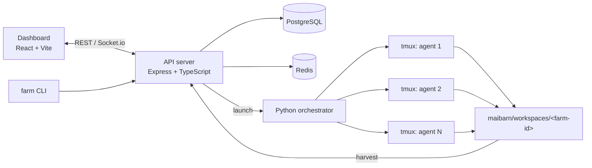

<div align="center">


# MaiFarm

**Multi-agent AI orchestration for software development**

Launch teams of AI coding agents, watch them work in real time, and harvest the results.

[](LICENSE)


[Quick start](#quick-start) · [How it works](#how-it-works) · [Project layout](#project-layout) · [Documentation](docs/README.md) · [Contributing](CONTRIBUTING.md)

</div>

---

## Overview

MaiFarm runs multiple AI agents (Claude Code, OpenAI, GPT-OSS, or Ollama) side by side in isolated tmux sessions. Each run, called a **farm**, shares one sandboxed workspace, streams every agent's terminal to a live dashboard, and ends with a **harvest** of the outputs.

- **Parallel agents.** Run 2 to 20 agents per farm, coordinated by a Python orchestrator.
- **Live terminals.** Agent output streams to the browser over WebSockets.
- **Isolation.** All agent output goes to `maibarn/` and never touches your codebase.
- **Confidence scoring.** Agents score their own confidence and auto-continue above a threshold ([blerbz-plugins](https://github.com/Blerbz/blerbz-plugins)).
- **Several providers.** Use Claude or OpenAI through their APIs, or run GPT-OSS or Ollama locally.
- **Apps.** A web dashboard, a `farm` CLI, and a native iOS companion app.

## Quick start

### Prerequisites

| Tool | Version |
|------|---------|
| Node.js | 18+ (see `.nvmrc`) |
| PostgreSQL | 15+ |
| Redis | 6.2+ |
| Python | 3.9+ |
| tmux | 3.0+ |

### Install and run

```bash
git clone https://github.com/MoRohn/maifarm.git
cd maifarm

cp .env.example .env.development   # then add your provider API key
npm run setup:all                   # installs deps, creates the database, verifies tooling
npm run start                       # starts the API and dashboard
```

| Service | URL |
|---------|-----|
| Dashboard | http://localhost:3000 |
| API + WebSocket | http://localhost:4567 |

Run `npm run setup:doctor` if something doesn't start.

### Farm CLI

```bash
./install-farm-command.sh      # adds `farm` to your shell

farm                           # open the dashboard
farm quick "fix the flaky login test"
farm create "auth-refactor" --agents 3
farm wild "explore caching opportunities"
```

## How it works



### Execution modes

| Mode | Default duration | Agents | Best for |
|------|------------------|--------|----------|
| **Quick Task** | 15 min | 2 | Bug fixes, reviews |
| **Farm** | 2 hours | 2–10 | Features, refactoring |
| **GoWild** | 1.5 hours | 3–20 | Research, open-ended exploration |

A farm moves through `idle → launching → running → completed | failed`. When it shuts down, the shutdown coordinator collects the workspace into a harvest that you can browse and download from the dashboard.

### AI providers

Set `AI_PROVIDER` in `.env.development`:

| Provider | Value | Requires |
|----------|-------|----------|
| Anthropic Claude | `claude` | `ANTHROPIC_API_KEY` |
| OpenAI | `openai` | `OPENAI_API_KEY` |
| GPT-OSS (local) | `gpt_oss` | `./scripts/setup/setup-gpt-oss-models.sh` |
| Ollama (local) | `ollama` | `OLLAMA_HOST` |

## Project layout

```
maifarm/
├── apps/
│   ├── api/            # Express + Socket.io backend (TypeScript ESM)
│   ├── dashboard/      # React 18 + Vite frontend
│   ├── orchestrator/   # FastAPI orchestrator service (Python)
│   └── shared/         # Types shared by API and dashboard
├── cli/                # `farm` command-line tool
├── ios/                # iOS companion app (SwiftUI + Capacitor)
├── scripts/
│   ├── python/         # Multi-agent orchestrator and agent runners
│   ├── setup/          # Installation and environment bootstrap
│   ├── dev/            # Local startup and streaming helpers
│   ├── db/             # Backups, restores, and SQL utilities
│   ├── deploy/         # Deployment, rollback, and readiness checks
│   ├── diagnostics/    # Troubleshooting for farms and terminals
│   ├── testing/        # Scripted end-to-end and load tests
│   ├── maintenance/    # Codemods and plugin updates
│   ├── xcode/          # iOS build automation
│   └── demo/           # Demo recording
├── tests/              # Jest, Playwright, and manual test suites
├── tools/              # Test and build tool configuration
├── ops/                # Docker, nginx, and monitoring configuration
├── docs/               # Architecture, guides, and runbooks
└── maibarn/            # Runtime farm output (git-ignored)
```

## Development

```bash
npm run dev            # API (watch) + dashboard
npm run typecheck      # TypeScript
npm run lint           # ESLint
npm test               # Jest
npm run test:server    # API test suite
make ci                # Python orchestrator: ruff, mypy, pytest
```

Useful diagnostics:

```bash
npm run db:health                          # database health (add :fix to repair)
TMUX_TMPDIR=/tmp tmux list-sessions        # live agent sessions
curl -X POST localhost:4567/api/farms/<id>/recover   # recover a stuck farm
```

See [Troubleshooting](docs/operations/TROUBLESHOOTING.md) for more.

## Documentation

| Topic | Guide |
|-------|-------|
| Setup | [docs/development/SETUP.md](docs/development/SETUP.md) |
| Architecture | [docs/architecture/](docs/architecture/) |
| CLI and features | [docs/features/](docs/features/) |
| Production and runbooks | [docs/operations/](docs/operations/) |
| Quick references | [docs/reference/](docs/reference/) |

Start with the [documentation index](docs/README.md).

## Contributing

Contributions are welcome. Read [CONTRIBUTING.md](CONTRIBUTING.md), then:

```bash
git checkout -b feat/your-change
npm run typecheck && npm run lint && npm test
```

## License

[MIT](LICENSE)

---

<details>
<summary>🌾 You read all the way down here</summary>

The `farm` CLI has a few hidden commands that don't appear in `--help`:

```bash
farm fart      # for when you mistype "farm"
farm konami    # ↑ ↑ ↓ ↓ ← → ← → B A
farm secrets   # lists the hidden commands
```

</details>
